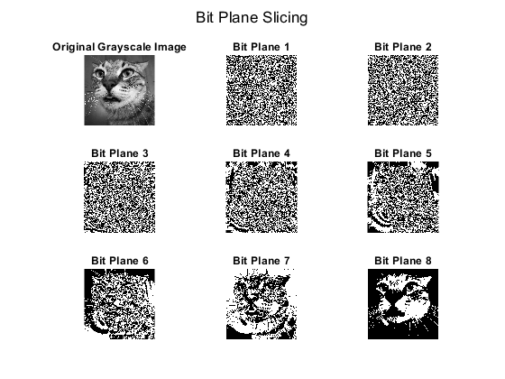

# Bit Plane Slicing  

## Author  
**Name:** Jjateen Gundesha  
**Roll Number:** BT22ECI002  

---

### Overview  
This repository contains a MATLAB script for performing **Bit Plane Slicing** on grayscale images. The script helps visualize how individual bits in an 8-bit grayscale image contribute to its overall appearance.  

The application:  
- Allows you to browse and select an image file.  
- Automatically converts the image to grayscale if it's in RGB format.  
- Extracts and visualizes individual bit planes (1 to 8).  
- Displays the original image alongside its bit planes in a 3x3 grid layout.  

---

### Concept  
**Bit Plane Slicing** involves breaking an 8-bit grayscale image into 8 binary images (bit planes), where each plane represents a single bit of the pixel intensity values:  
- **Plane 1 (LSB)**: Shows the least significant bit.  
- **Plane 8 (MSB)**: Represents the most significant bit.  

The general formula for bit plane extraction is:  

&space;=&space;\text{bitget}(I(x,&space;y),&space;i))  
Where:  
- \( B_i(x, y) \): Value of the \( i \)-th bit at pixel \((x, y)\).  
- \( I(x, y) \): Intensity of the pixel \((x, y)\).  
- \( i \): Bit position (1 to 8).  

---

### How to Use  
1. **Run the Script**:  
   Execute the `bit_plane_slicing.m` script in MATLAB:  
   ```matlab
   >> bit_plane_slicing
   ```  

2. **Load an Image**:  
   - A file dialog will open for you to select an image (`*.jpg`, `*.png`, `*.bmp`).  

3. **View Results**:  
   - The **Original Image** is displayed alongside its **8 Bit Planes** in a 3x3 grid.  
   - Bit planes are ordered from 1 (bottom-right) to 8 (top-left).  

---

### Example Output  
#### Original Grayscale Image:  
- The input image is converted to grayscale (if required) and displayed in the top-left cell.  

#### Bit Planes:  
- The remaining cells show binary images representing each bit plane:  
  - **Plane 1 (LSB)**: Lowest bit, representing finer details/noise.  
  - **Plane 8 (MSB)**: Highest bit, representing the main structure of the image.  



---

### Requirements  
- MATLAB R2022a or newer  

---

### Output Analysis  
- **Lower Bit Planes (1-4)**: Capture finer image details and noise.  
- **Higher Bit Planes (5-8)**: Represent the majority of the image's structure and intensity.  
- Combining planes (e.g., MSB planes) can approximate the original image while excluding lower planes reduces noise but sacrifices detail.  

---

### References  
- [Bit Plane Slicing - Image Processing Fundamentals](https://en.wikipedia.org/wiki/Bit-plane_slicing)
