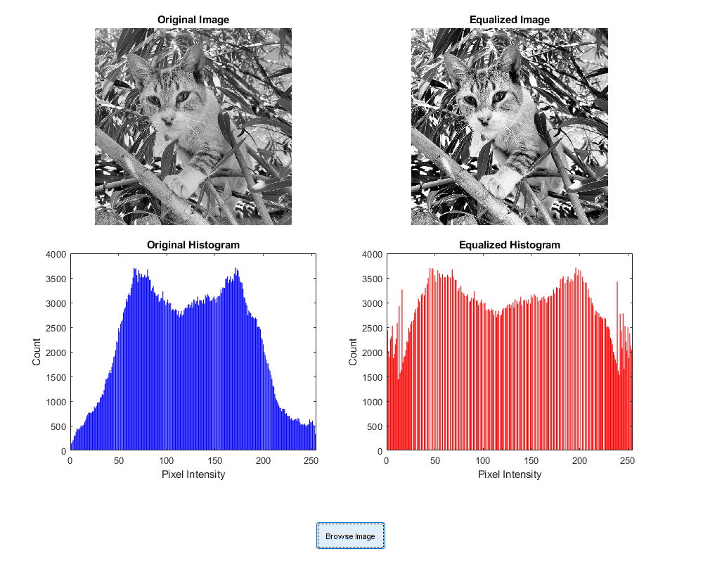

# Histogram Equalization via GUI  

## Author  
**Name:** Jjateen Gundesha  
**Roll Number:** BT22ECI002  

---

### Overview  
This repository contains a MATLAB application with a graphical user interface (GUI) for performing histogram equalization on grayscale images. The GUI allows users to:  
- Browse and select an image file.  
- Apply histogram equalization to enhance image contrast.  
- View the original and equalized images side-by-side.  
- Display the cumulative distribution function (CDF) and histogram of the image before and after equalization.

---
 
- **Histogram Equalization Formula**:  
  The general formula used for histogram equalization is:  
  &space;=&space;\mathrm{round}\left(\frac{\operatorname{cdf}(v)-\operatorname{cdf}_{\min}}{(M\times&space;N)-\operatorname{cdf}_{\min}}\times&space;(L-1)\right))  
  Where:  
  - ): Cumulative distribution function for intensity value \( v \).  
  - : Minimum non-zero CDF value.  
  - : Total number of pixels in the image.  
  - : Number of gray levels (typically 256).  

---

### How to Use  
1. **Launch the Application**:  
   Run the `histogram_equalization.m` script in MATLAB:  
   ```matlab  
   >> histogram_equalization  
   ```  

2. **Load an Image**:  
   - Click the "Browse Image" button to select a grayscale image (`*.jpg`, `*.png`, `*.bmp`).  

3. **View Results**:  
   - The **Original Image** and its histogram are displayed on the left.  
   - The **Equalized Image** and its histogram are displayed on the right.  
   - The corresponding CDF plots and the applied formula are also shown.  

---

### Example Output  
- **Equalized Image Example**:  
    

- **Explanation for Example**:  
  For an example image, the minimum CDF value in the subimage is 52, and the maximum is 154. The normalized value is computed using the formula:  
  &space;=&space;\mathrm{round}\left(\frac{\operatorname{cdf}(v)-1}{63}\times&space;255\right))  
  For instance, for \( v = 78 \) with &space;=&space;46):  
  &space;=&space;\mathrm{round}\left(\frac{46-1}{63}\times&space;255\right)&space;=&space;182)  

---

### Requirements  
- MATLAB R2022a or newer  
- Image Processing Toolbox  

---

### Output Analysis  
- Histogram equalization enhances the contrast by redistributing pixel intensity values.  
- The updated CDF ensures that pixel intensities are evenly distributed across the available range, typically [0, 255].  
- The resulting image appears clearer and exhibits improved visual detail compared to the original.  

---

### References  
- [Histogram Equalization - Wikipedia](https://en.wikipedia.org/wiki/Histogram_equalization)  
