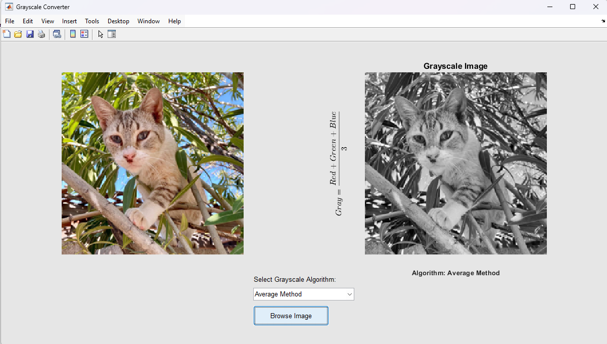
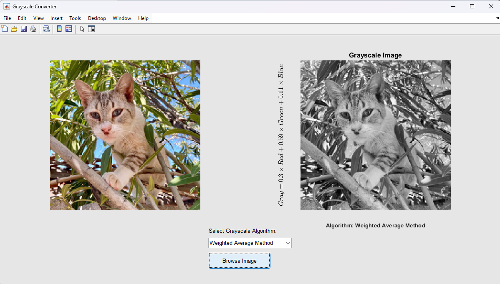
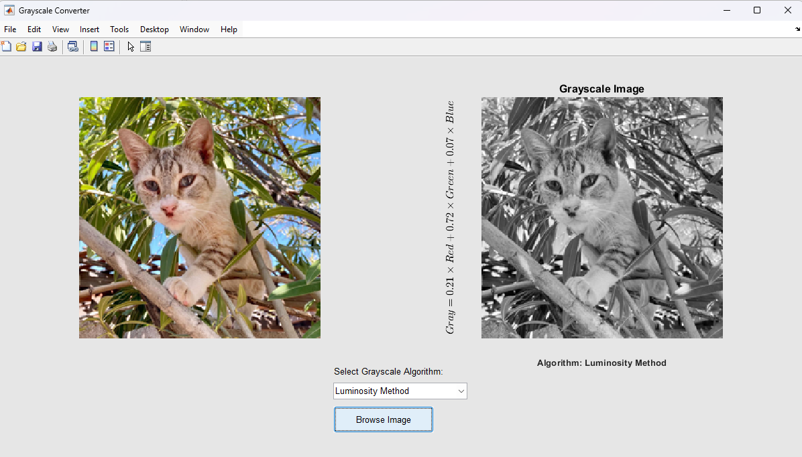
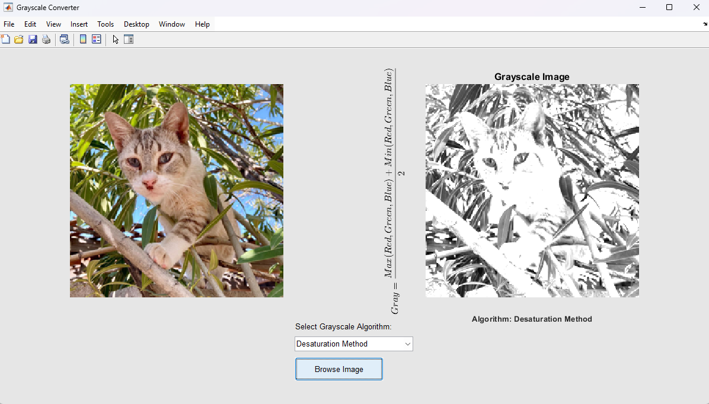

# RGB to Grayscale Conversion Algorithms via GUI  

## Author
**Name:** Jjateen Gundesha  
**Roll Number:** BT22ECI002  

---

### Overview
This repository contains a MATLAB application that provides a graphical user interface (GUI) for converting RGB images to grayscale using various algorithms. The GUI allows users to:  
- Browse and select an image file.  
- Apply one of four grayscale conversion algorithms.  
- View the original and processed images side-by-side.  
- Display the formula of the selected algorithm using LaTeX-rendered text.  

---

### Features
- **User-Friendly Interface**: Intuitive controls and clear layout for seamless usage.  
- **Multiple Grayscale Algorithms**:  
  - **Average Method**
    
    
  - **Weighted Average Method**
  
    
  - **Luminosity Method**
   
    
  - **Desaturation Method**
    
    &space;&plus;&space;Min(Red,&space;Green,&space;Blue)}{2})
- **Dynamic Output**: Real-time display of results with labeled formulas.  

---

### How to Use
1. **Launch the Application**: Run the `GrayscaleConversionGUI.m` script in MATLAB.  
   ```matlab
   >> GrayscaleConversionGUI
   ```
2. **Browse an Image**:
   - Click the "Browse Image" button.
   - Select an RGB image (`*.jpg`, `*.png`, `*.bmp`).

3. **Choose an Algorithm**:
   - Use the dropdown menu to select one of the four grayscale conversion methods.
   - The formula and result will be displayed dynamically.

4. **View Results**:
   - The **Original Image** will be displayed on the left.
   - The **Grayscale Image** with its algorithm formula will appear on the right.

---

### Output Examples
- **Average Method**  
  

- **Weighted Average Method**  
  

- **Luminosity Method**  
  

- **Desaturation Method**  
  

---

### Requirements
- MATLAB R2022a or newer  
- Image Processing Toolbox  

---
