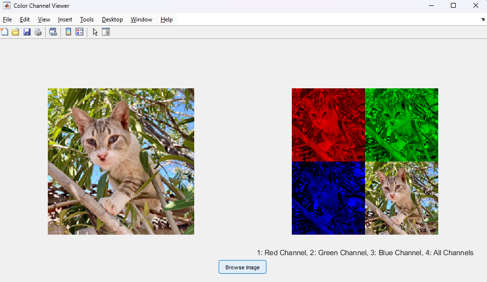

# MATLAB GUI Application: Color Channel Viewer

## Author
**Name:** Jjateen Gundesha  
**Roll Number:** BT22ECI002  

---

## Description
The **Color Channel Viewer** is a MATLAB GUI application designed to process and visualize an image. The application allows users to:  
1. Browse and load an image from their local system.  
2. Display the original image on the left-hand side of the GUI.  
3. Display a montage of the color channels (Red, Green, Blue, and the original image) on the right-hand side of the GUI.

This tool is ideal for visualizing and understanding the distribution of color channels in an image.

---

## Features
- **Interactive GUI**: Simple and intuitive user interface.  
- **Image Selection**: Load images of various formats (`.jpg`, `.png`, `.bmp`) using a file browser.  
- **Color Channel Visualization**: View individual color channels (Red, Green, Blue) alongside the original image.  

---

## How to Run
1. Open the MATLAB environment.
2. Save the provided script as `ColorChannelGUI.m`.
3. Run the script using the command:
   ```matlab
   ColorChannelGUI
   ```
4. Use the **Browse Image** button at the bottom to select an image file. The original image and the montage of its color channels will be displayed in the GUI.

---

## Example Output
Below is an example output of the application after loading an image.

  

- The **Original Image** is shown on the left.  
- The **Montage** of color channels (Red, Green, Blue, and the original image) is displayed on the right.  

---

## Supported Image Formats
- `.jpg`
- `.png`
- `.bmp`

---

## Notes
- Ensure that the image file is accessible from your local system.  
- The GUI automatically resizes the image to 224x224 pixels for consistent display.  

---